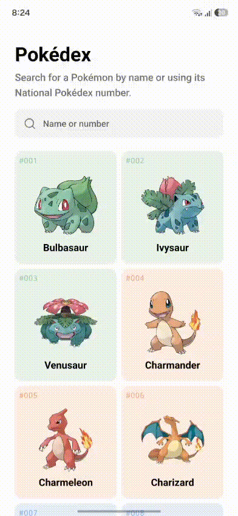

# Pokédex

[](https://expo.dev/)
[](https://reactnative.dev/)
[](https://www.typescriptlang.org/)
[](https://www.nativewind.dev/)
[](https://pokeapi.co/)



## About

Pokédex is a cross-platform mobile app built with Expo and React Native. It fetches Pokémon data from [PokéAPI](https://pokeapi.co/), presents Pokémon in a two-column grid, and opens a detail sheet for each Pokémon.

The app currently includes:

- A Pokémon grid with official artwork and National Pokédex numbers
- Type-based card colors
- A detail sheet with Pokémon types, height, weight, and base experience
- iOS, Android, and web support through Expo
- Typed routes and React Compiler support through Expo Router

## Tech Stack

- Expo 57
- Expo Router
- React Native
- TypeScript
- NativeWind and Tailwind CSS
- PokéAPI
- pnpm

## Prerequisites

- Node.js 20 or newer
- pnpm
- Expo Go for testing on a physical device, or an iOS/Android simulator

## Clone and Run

```bash
git clone https://github.com/your-username/pokedex.git
cd pokedex
pnpm install
pnpm start
```

After the development server starts, use the Expo developer menu or one of the platform-specific commands below:

```bash
pnpm ios      # Start the iOS simulator
pnpm android  # Start the Android emulator
pnpm web      # Start the web version
```

## Development Commands

```bash
pnpm start          # Start the Expo development server
pnpm lint           # Run Expo linting
pnpm reset-project  # Reset the starter project structure
```

## Data Source

Pokémon data is provided by [PokéAPI](https://pokeapi.co/). An internet connection is required while the app fetches the Pokémon list and detail data.

## License

This project is available under the terms of the [MIT License](LICENSE).
